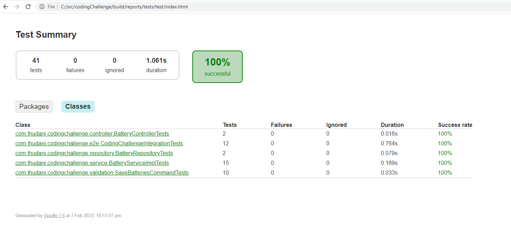
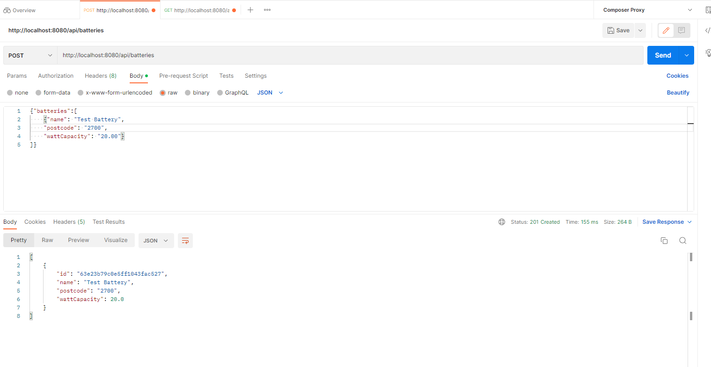
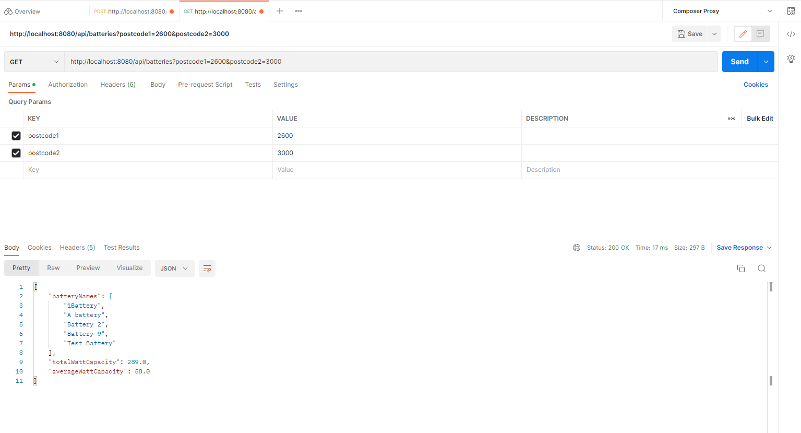
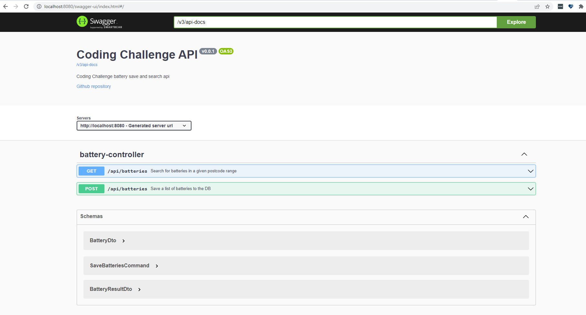

# Battery service

Battery service stores a list of batteries along with their postcodes and let the clients search for batteries in a
given postcode range The service provides two endpoints

1. /api/batteries POST endpoint which accepts a list of batteries and saved them to the DB
2. /api/batteries?postcode1=<postcode1>&postcode2=<postcode2> GET endpoint retrieves a list of batteries in the postcode
   range postcode1:postcode2

## Assumptions

* For saving all three battery fields (name, postcode and watt capacity) are mandatory for battery list provided
* For searching a client must always provide two postcodes
* Search endpoint returns the names first 50 (or less) batteries in the alphabetical order together with the statistics
  for whole range

## Technical overview

* Backend service is implemented using Springboot
* The database used is Mongodb
* The docker-compose file in src/main/resources is used to start a mongo db container together with mongo-express
* In addition to name lowercase name of the batteries are stored to support case-insensitive sorting
* Battery collection is indexed by a compound index on postcode and lowercaseName fields
* When saving batteries, data are processed on batches of 300 batteries
* springdoc is used for api documentation and controller and DTOs are annotated to generate swagger content (swagger
  url: http://<service host:port>/swagger-ui/index.html)

# Test results

# Local running

# Swagger

